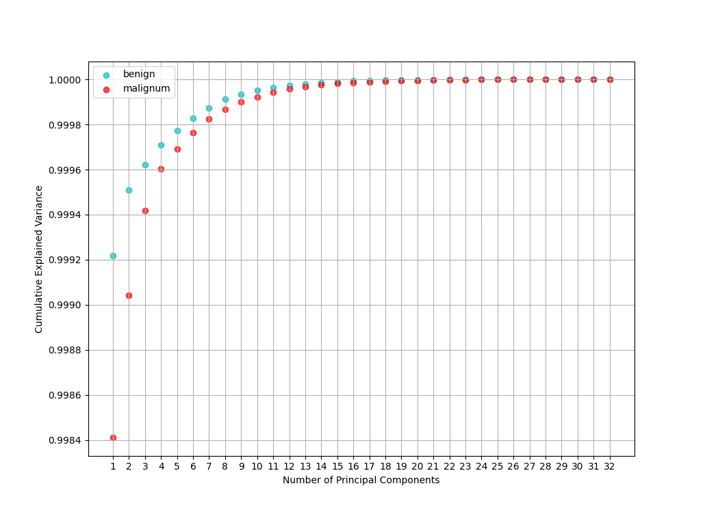
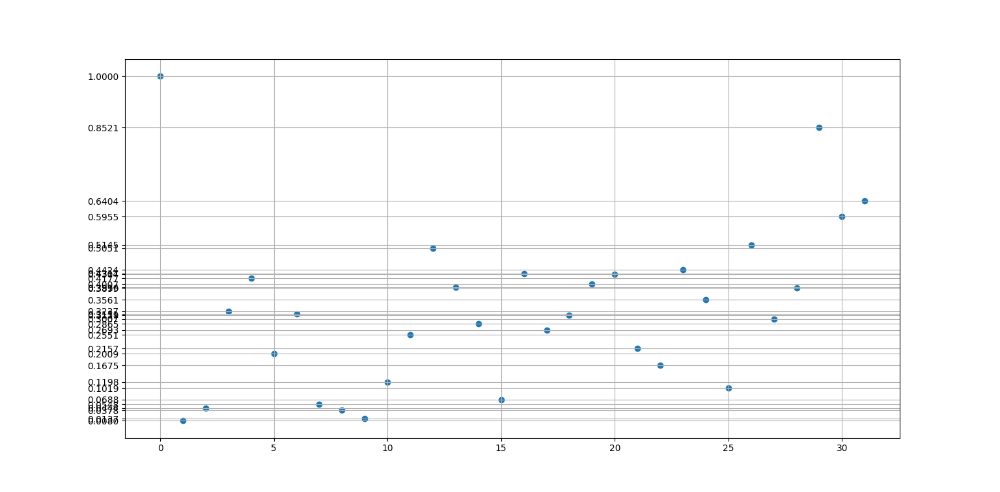

# Principal Component Analysis in Python

PCA is, above all, a linear mapping.

PCA defines a new **orthogonal coordinate system** 
that optimally describes **variance** in a single dataset.

The most variables are correlated to each other,
the most is usefull to apply PCA.

The principal components are often computed by
**eigendecomposition** of the **data covariance matrix** 
or **singular value decomposition** of the **data matrix**.

1. **centralize** and **normalize** data
2. compute **covariance matrix** of data
3. **eigendecompose** covariance matrix of data
4. **normalize** eigenvectors

When in eigenvector basis,
covariance matrix of data 
is a diagonal matrix of each new axis variance 
(each one being directly proportional to eigenvalues) 

Scree plots can be useful to 
track the variance decay along principal components,
choose the amount of principal components to keep,
and interpret the finding of PCA in general
https://en.wikipedia.org/wiki/Scree_plot

Together with biplot https://en.wikipedia.org/wiki/Scree_plot

# Classification using Raw PCA

(See references) Raw PCA can be used to Classification by 
computing the principal components of each class, 
then we may assume a new datapoint projected into each Class Principal Componets Basis
will have small representation error for the class it belongs,
and a big representation error for the classes it does not belong.

## Breast Cancer Wisconsis DataSet

32 numerical features. Each register is labeled in Benign or Malignum

### Principal Components decomposition of each class

This features are incredibilly highlly correlated. 
A single linear combination (resulting in a single scalar!) 
of the features of a samples is enough to 
represent more than 99% of the data variance

The cumulative explained variance of the classes show that 
Benign tumours are relatively slightly more correlated 
than Malignous ones. 

Although both classes show to be very representable in few components, we may expect some fake negatives for Malignum, 
since its **relatively** harder for _Malign_ to be resumed by less components (In comparisson to _Benign_). 
I.e. I expect the majority of errors from the model to come from
Malignous samples being classified as Benign ones.

The main thesis success can be previewd by checking (un)similarity 
measurements dimension-wise between the found principal components
for each class.

OOPS ! Both classes have THE SAME principal component 0 (99.9% of data variability). 
So there will be no reconstruction error relative to PC1. 
We'll need to change approachs here.

Or is 0.1% of variability enough to generate significative recosntruction error ?

The original autors do not considered removing redundant similar principal components

I must find a way to ponder, for each principal component:
(explained variability) x (ortogonality w/ PCn of other dataset) 
so i can decide to remove or keep each componet based on that,
not only its explained variability

NÃO BASTA O PC_i EXPLICAR BEM A VARIABILIDADE DO DATASET DELE,
ELE TAMBÉM PRECISA EXPLICAR MAL A VARIABILIDADE DO OUTRO DATASET

o quao mal ele explica a variabilidade do outro dataset 
realmente é dado pela cos_sim com seu correspondente do outro dataset?
é melhor medir a variancia dos dados na direção dele.

Ou seja, ao inves de encontrar a base que melhor expressa o dataset,
podemos encontrar a base que melhor expressa sua diferença em relação a outro dataset

instead of ordering principal component of A by explained variance of A,
we could order they by (explained variance of A)/(explained variance of B) or something like that.

notice how adding a PC of A is always a gain of info, since this ratio certainly is >1.
My claim is not that some PCs could bring debt, but that a lower PC can potentially bring more info than a higher one.

## References
* [_Principal Component Analysis_ (2026) -- Wikipedia](https://en.wikipedia.org/wiki/Principal_component_analysis)
* [_Object detection using image reconstruction with PCA_ (2009) -- Luis Malagón-Borja, Olac Fuentes](https://drive.google.com/file/d/18UFTN1yL34RFQ86GuMTJgNj5UX6Tyjl4/view?usp=sharing)